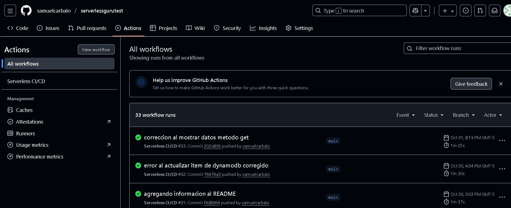
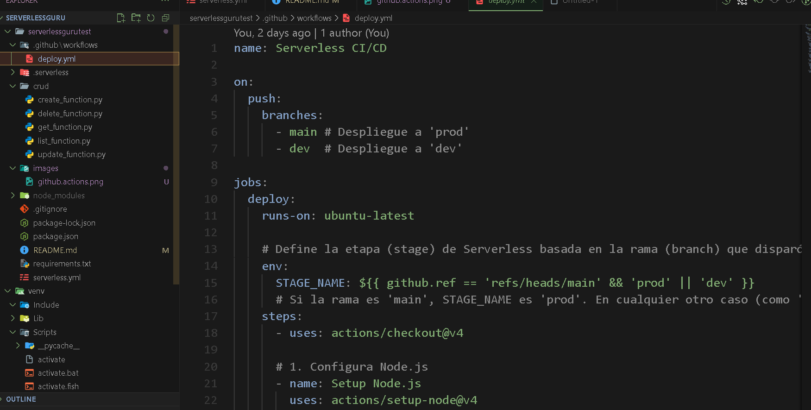

# Challenge Serverless CRUD REST API con Serverless Framework, Python y DynamoDB.

Implementación de una API RESTful CRUD (Create, Read, Update, Delete) 
sin servidor utilizando AWS API Gateway, AWS Lambda (runtime Python 3.11), y 
Amazon DynamoDB. La infraestructura como codigo se gestiona con Serverless Framework, 
y el despliegue está automatizado mediante un pipeline de CI/CD con GitHub Actions.

✅ Funcionalidad CRUD Completa: Implementada con 5 handlers de Lambda 
(uno para cada operación: Create, Read/List, Update, Delete).

✅ Infraestructura como Codigo (IaC): Utilizacion de Serverless Framework para automatizar el aprovisionamiento de Lambda, API Gateway y DynamoDB (ver serverless.yml).

✅ Integración de aws  Lambda con API Gateway: esta integracion se realiza a 
traves de funciones con Lambda, evitando el uso directo de la integracion de 
proxy de servicio de API Gateway a DynamoDB según lo solicitado.

✅ CI/CD para Despliegues Multi-Stage usando GitHub Actions: Configurado un pipeline para despliegues automatizados a los entornos dev y prod (ejecutado con push a la rama main).

✅ Codigo y Documentación: Repositorio publico con historial de commits y documentacion completa.

✅ Link del video de explicacion de codigo
 https://drive.google.com/file/d/15S8s1zAirYcLYlMj9RnlbPXkHZdCQCB7/view?usp=sharing

Imagenes de la configuracion del despliegue ci/cd y pruebas de que github actions funciona

Nota: en la reunion anterior se comento de la posibilidad de hacerlo con python
que es mi mayor fuerte aunque si tengo buen conocimiento de typescript y un poco de node.js